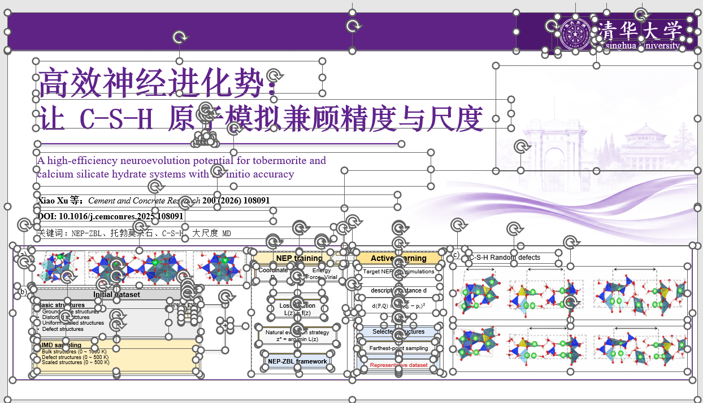
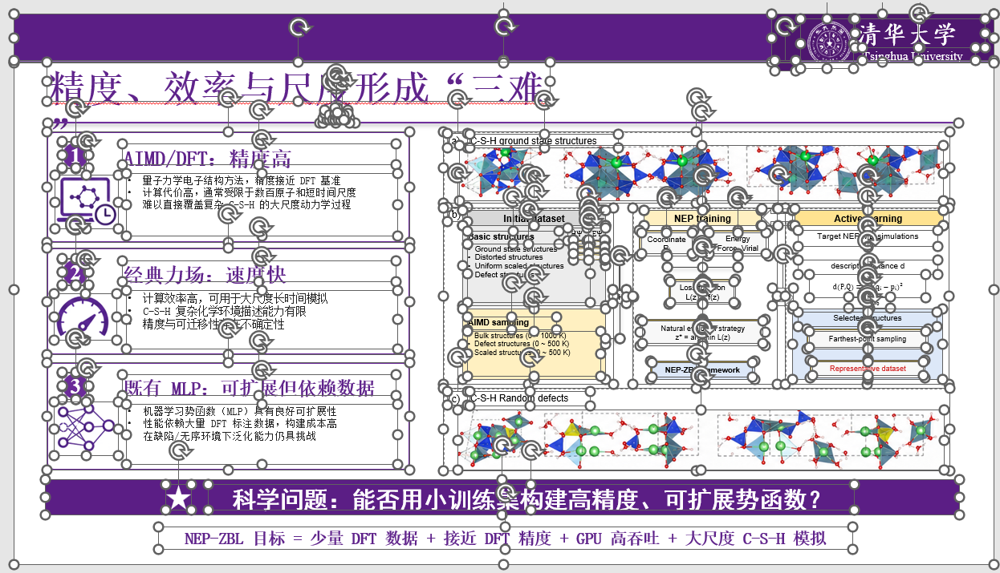

# codeximage-to-editable-ppt-v2-1

这是一个 Codex 技能，用于将基于图片的 PowerPoint 演示文稿和幻灯片截图，重建为忠实还原原稿、可编辑的 PPTX 文件，并通过“验证不通过则禁止交付”的质量校验机制保障交付质量。

本技能适用于已经扁平化的栅格幻灯片，包括整页截图、仅包含图片的 PPT/PPTX 文件、扫描版幻灯片，以及大部分可见内容并非 PowerPoint 原生对象的演示文稿。技能采用混合保真重建策略：

- 将清晰可辨的文字重建为可编辑的 PowerPoint 文本框；
- 将简单结构重建为 PowerPoint 原生形状；
- 将复杂或对视觉风格敏感的图形保留为独立、具有明确语义的 PNG 素材；
- 对复杂的整页背景，可在人工审核的前提下使用图像生成能力进行重建；
- 在元素清单、裁剪、背景和 PowerPoint 渲染质量等必要校验项全部通过前，禁止最终交付。

自动化拆分脚本用于生成基线结果和审核证据，其输出本身不能视为已经完成的 v2.1 精细化交付成果。

## 输出成果

- 不可变更的原始页面图像
- 独立的语义化 PNG 元素
- CSV 和 JSON 格式的视觉元素清单
- 裁剪与背景视觉审核结果
- 元素审核叠加图和棋盘格透明度预览图
- 用于参考的基线重组 PPTX
- 通过 Codex 工作流制作的精细化可编辑 PPTX
- PowerPoint 渲染预览和逐页质量报告
- “验证不通过则禁止交付”的交付校验报告
- 可复现的批处理汇总结果和合并后的基线演示文稿

## 示例

### 案例 01——C-S-H 神经进化学术幻灯片

左侧为原始扁平化幻灯片，右侧为使用 v2.1 在 PowerPoint 中重建的结果。右图中的选择框和控制点表明，页面由可独立选择、编辑的对象组成。

<table>
  <tr>
    <th width="50%">原始扁平化幻灯片</th>
    <th width="50%">可编辑的 PowerPoint 重建结果</th>
  </tr>
  <tr>
    <td width="50%">
      <a href="examples/case-01-csh-neuroevolution-slide/original-slide.png">
        
      </a>
    </td>
    <td width="50%">
      <a href="examples/case-01-csh-neuroevolution-slide/editable-powerpoint-view.png">
        
      </a>
    </td>
  </tr>
</table>

[查看案例详情](examples/case-01-csh-neuroevolution-slide/)。

### 案例 02——C-S-H 三项挑战学术幻灯片

左侧为原始扁平化幻灯片，右侧为使用 v2.1 在 PowerPoint 中重建的结果。右图中的选择框和控制点表明，页面由可独立选择、编辑的对象组成。

<table>
  <tr>
    <th width="50%">原始扁平化幻灯片</th>
    <th width="50%">可编辑的 PowerPoint 重建结果</th>
  </tr>
  <tr>
    <td width="50%">
      <a href="examples/case-02-csh-three-challenges-slide/original-slide.png">
        
      </a>
    </td>
    <td width="50%">
      <a href="examples/case-02-csh-three-challenges-slide/editable-powerpoint-view.png">
        
      </a>
    </td>
  </tr>
</table>

[查看案例详情](examples/case-02-csh-three-challenges-slide/)。

## 仓库结构

Codex 技能的实际文件位于：

```text
skills/codeximage-to-editable-ppt-v2-1
```

本技能与 `codeximage-to-editable-ppt-v1` 相互独立。安装本技能不会修改或替换 v1 技能。

## 安装为 Codex 技能

使用 Codex 技能安装程序从 GitHub 安装：

```bash
python ~/.codex/skills/.system/skill-installer/scripts/install-skill-from-github.py \
  --repo wiltonesten-web/codeximage-to-editable-ppt-v2-1 \
  --path skills/codeximage-to-editable-ppt-v2-1
```

PowerShell：

```powershell
python "$env:USERPROFILE\.codex\skills\.system\skill-installer\scripts\install-skill-from-github.py" `
  --repo wiltonesten-web/codeximage-to-editable-ppt-v2-1 `
  --path skills/codeximage-to-editable-ppt-v2-1
```

安装完成后的目录应为：

```text
%USERPROFILE%\.codex\skills\codeximage-to-editable-ppt-v2-1
```

如需手动安装，只需将 `skills/codeximage-to-editable-ppt-v2-1` 文件夹复制到 Codex 技能目录，不要将整个仓库根目录作为技能文件夹复制。

安装完成后重启 Codex，使其重新发现并加载该技能。

## Python 依赖

在仓库根目录执行以下命令安装 Python 软件包：

```bash
pip install -r skills/codeximage-to-editable-ppt-v2-1/requirements.txt
```

按实际使用场景安装以下系统依赖：

- `PATH` 中可用的 LibreOffice，用于 PPT/PPTX 备用转换和预览导出；
- Poppler 工具，包括用于 PDF 页面栅格化的 `pdftoppm`；
- Tesseract OCR，以及 `eng`、`chi_sim` 等所需语言包；
- Microsoft PowerPoint 或具备同等保真能力的渲染程序，用于严格的最终质量检查；
- 需要重建复杂背景时使用 Codex 的 `imagegen` 技能。

Ubuntu/Debian 安装示例：

```bash
sudo apt-get update
sudo apt-get install -y \
  libreoffice \
  poppler-utils \
  tesseract-ocr \
  tesseract-ocr-eng \
  tesseract-ocr-chi-sim
```

## 基线拆分

执行自动化基线拆分：

```bash
python skills/codeximage-to-editable-ppt-v2-1/scripts/decompose_visual_elements.py \
  input.pptx \
  --outdir baseline_output \
  --dpi 300 \
  --granularity fine \
  --ocr \
  --ocr-lang chi_sim+eng \
  --ocr-confidence-threshold 75 \
  --editable-text \
  --review \
  --quality-check
```

使用示例配置执行：

```bash
python skills/codeximage-to-editable-ppt-v2-1/scripts/decompose_visual_elements.py \
  input.pptx \
  --config skills/codeximage-to-editable-ppt-v2-1/config.example.yaml \
  --outdir baseline_output
```

基线输出仅用于发现和审核，不能作为满足严格 v2.1 标准的最终交付成果。

## 精细化可编辑重建

在 Codex 中使用类似以下提示词调用技能：

```text
使用 $codeximage-to-editable-ppt-v2-1 将 input.pptx 重建为忠实还原原稿的
可编辑 PowerPoint，并通过所有强制性交付校验。
```

该技能将指导 Codex 完成以下工作：

1. 保持原始页面不变；
2. 仅将自动化基线结果用于元素发现；
3. 根据最终呈现方式对每个可见对象进行分类；
4. 将文字和简单结构重建为可编辑的 PowerPoint 原生对象；
5. 将复杂图形拆分为独立的语义化 PNG 素材；
6. 生成裁剪、背景、元素清单和质量审核证据；
7. 检查从最终 PPTX 导出的渲染结果；
8. 任一强制校验项未解决时禁止交付。

## 交付校验

交付前，对精细化输出执行以下校验：

```bash
python skills/codeximage-to-editable-ppt-v2-1/scripts/validate_delivery.py \
  refined_output \
  --pptx presentation_refined_editable.pptx
```

退出码为 `0` 表示所有可由程序检查的校验项均已通过；退出码非零表示该演示文稿不得作为完成严格校验的成果交付。

校验内容包括：

- 原始页面与 PPTX 的宽高比一致性；
- 可读文字的可编辑性和简单结构的原生化；
- 语义化 PNG 素材的独立性和归属关系；
- 裁剪透明度、残留内容、重复内容和重叠情况的审核证据；
- 大面积背景的来源和前景移除证据；
- 尚未解决的审核事项；
- PowerPoint 对象溢出，以及元素清单与 PPTX 对象的对应关系；
- 逐页通过/不通过状态和必要的质量统计指标。

## 批量处理

以可复现的批次方式重复执行基线拆分：

```bash
python skills/codeximage-to-editable-ppt-v2-1/scripts/run_batches.py \
  input_folder \
  --outdir batch_output \
  --recursive \
  --batch-size 2 \
  --batch-workers 2 \
  --dpi 300 \
  --granularity fine \
  --ocr \
  --ocr-lang chi_sim+eng \
  --ocr-confidence-threshold 75 \
  --editable-text \
  --review \
  --quality-check
```

批处理成功仅表示基线脚本执行完毕。每个经过人工整理的精细化演示文稿仍须单独通过 `validate_delivery.py` 校验。

## 精细化输出目录结构

```text
<name>_refined_editable.pptx
<name>_refined_editable_output/
|-- source_pages/
|-- split_png_elements/
|-- split_png_elements.zip
|-- visual_elements_manifest.csv
|-- visual_elements_manifest.json
|-- image_source_report.csv
|-- image_source_report.json
|-- review/
|   |-- <page>_refined_elements_overlay.png
|   |-- background_visual_audit/
|   |   |-- background_audit.csv
|   |   `-- <page>_<background>_audit.png
|   `-- crop_visual_audit/
|       |-- crop_audit.csv
|       |-- crop_audit.json
|       `-- all_crop_audit.png
|-- quality_preview/
|   `-- powerpoint_export/
|-- quality_report/
|   |-- quality_report.csv
|   |-- quality_report.json
|   |-- <page>_original.png
|   |-- <page>_recomposed.png
|   |-- <page>_diff.png
|   |-- delivery_validation.csv
|   `-- delivery_validation.json
`-- recomposed_from_elements.pptx
```

## 重要限制

- 栅格输入无法完美恢复原始矢量图形、隐藏文字、图表数据、字体、动画或对象语义；
- OCR 结果必须经过人工复核，尤其是中文、公式、小字号文字、图表和密集标签；
- 当使用原生对象重绘会降低还原度时，复杂图形可以继续保留为栅格素材；
- 图像生成完成不等于已经获得有效的纯净背景，仍须进行视觉审核和最终 PowerPoint 渲染检查；
- 不要将含有机密信息的源演示文稿或专有素材上传到公开 Issue 或示例目录。

## 项目状态

本仓库以独立社区项目的形式提供 v2.1 技能，与 OpenAI 或 Microsoft 不存在隶属、授权或背书关系。

## 许可证

本项目采用 MIT 许可证，详见 [LICENSE](LICENSE)。
